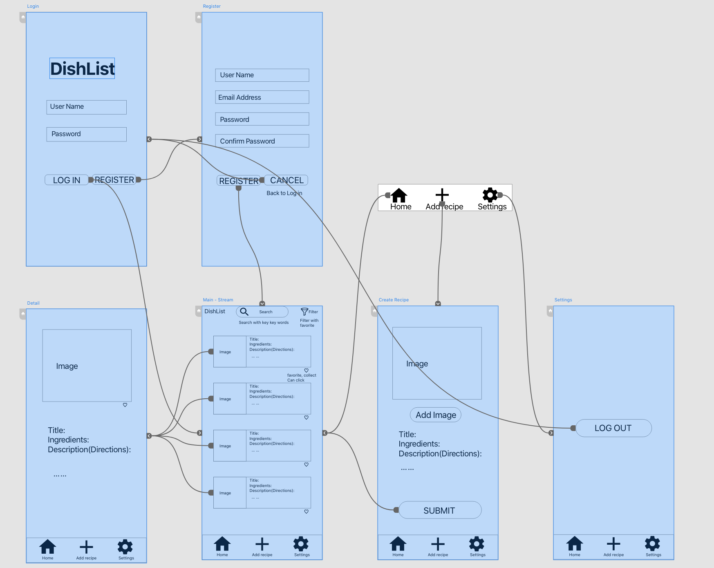
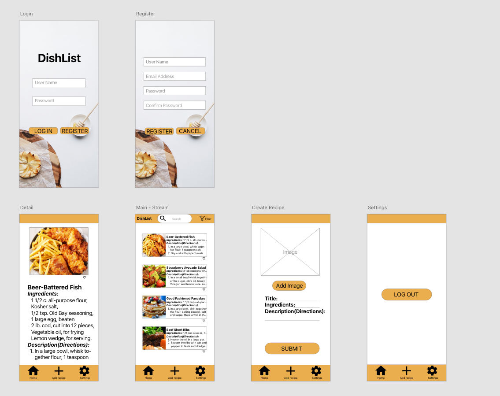
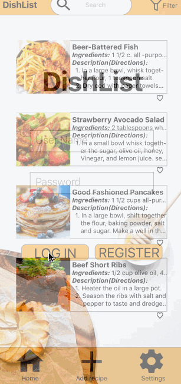

Original App Design Project - README Template
===

# DishList

## Table of Contents
1. [Overview](#Overview)
1. [Product Spec](#Product-Spec)
1. [Wireframes](#Wireframes)
2. [Schema](#Schema)

## Overview
### Description
Allows users to scroll through recipes with the use of an API.

### App Evaluation
[Evaluation of your app across the following attributes]
- **Category:** Recipe Catalog/Cooking
- **Mobile:** This app is developed for mobile phones/tablets. It's purpose is to have the portability so that the user can take it with them whereever with ease. Functionality will be limited to mobile devices. 
- **Story:** 
- **Market:** Anyone who cooks can use this app.
- **Habit:** This app could be used whenever someone wants to cook, or when someone is shopping for ingredients.
- **Scope:**

## Product Spec

### 1. User Stories (Required and Optional)

**Required Must-have Stories**

* [fill in your required user stories here]
* User can see a list of recipes
* User can filter recipes
* User can open a specific recipe
* User can register an account
* User can log in

**Optional Nice-to-have Stories**

* [fill in your required user stories here]
* App will reopen on the same recipe if closed (persistence)
* User will remain logged in (persistence)
* User can add a recipe
* User can add a picture for their recipe
* User can save favorite recipes
* User can find recipes based on ingredients
* User can customize "look" of app(colors,font,etc)

### 2. Screen Archetypes

* Stream
   * User can see a list of recipes
   * User can filter recipes
   * User can save favorite recipes

* Details
   * User can open a specific recipe
   * User can save favorite recipes
   * App will reopen on the same recipe if closed (persistence)
 
* Register
   * User can register an account

* Login
   * User can log in

* Creation
   * User can add a recipe

* Settings
   * User can customize "look" of app(colors,font,etc)
   * User can Logout

### 3. Navigation

**Tab Navigation** (Tab to Screen)

* Home Feed
* Creation
* Settings

**Flow Navigation** (Screen to Screen)

* Login
    * Stream
    * Register

* Register
    * Login
    * Stream

* Stream
    * Details
    * Creation

* Creation
    * Stream

* Details
    * Stream

* Settings
    * Login

## Wireframes

### [BONUS] Digital Wireframes & Mockups           

### [BONUS] Interactive Prototype

## Schema 
[This section will be completed in Unit 9]
### Models
[Add table of models]
### Networking
- [Add list of network requests by screen ]
- [Create basic snippets for each Parse network request]
- [OPTIONAL: List endpoints if using existing API such as Yelp]
