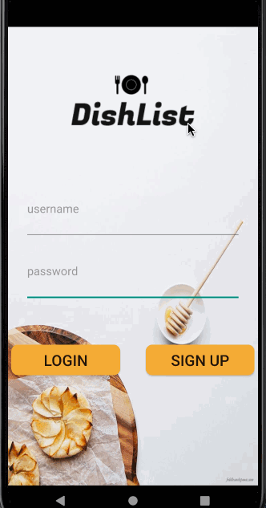

Original App Design Project - README Template
===

# DishList

## Table of Contents
1. [Overview](#Overview)
1. [Product Spec](#Product-Spec)
1. [Wireframes](#Wireframes)
2. [Schema](#Schema)

## Overview
### Description
DishList gives users the ability to find the recipe they are looking for without having to go through the hassle of manually searching for it. With the use of an API, users are able to scroll through recipes and filter to find that one recipe. Many users will come to enjoy multiple recipes, which is where DishList gives the users the ability to favorite recipes for future use.

### App Evaluation
[Evaluation of your app across the following attributes]
- **Category:** Recipe Catalog/Cooking
- **Mobile:** This app is developed for mobile phones/tablets. It's purpose is to have the portability so that the user can take it with them whereever with ease. Functionality will be limited to mobile devices. 
- **Story:** Searching through cookbooks or the internet for a recipe can be a headache. DishList makes it easy for people to share their own recipes and also be able to seek recipes they want to try.
- **Market:** Anyone who cooks or wants to learn how to cook can use this app.
- **Habit:** This app could be used whenever someone wants to cook, or when someone is shopping for ingredients.
- **Scope:** There are still many people today who cook frequently and some everyday, this app has the potential to take a chunk in the huge market that is the food industry.

## Product Spec

### 1. User Stories (Required and Optional)

**Required Must-have Stories**

* [fill in your required user stories here]
- [X] User can register an account
- [X] User can log in
- [X] User can see a list of recipes
- [ ] User can search/filter recipes
- [ ] User can open a specific recipe
- [ ] User can save favorite recipes


**Optional Nice-to-have Stories**

* [fill in your required user stories here]
- [ ] App will reopen on the same recipe if closed (persistence)
- [ ] User will remain logged in (persistence)
- [ ] User can add a recipe
- [ ] User can add a picture for their recipe
- [ ] User can find recipes based on ingredients


### App Walkthough GIF

<br> 


### 2. Screen Archetypes

* Stream
   * User can see a list of recipes
   * User can filter recipes
   * User can favorite recipes

* Details
   * User can open a specific recipe
   * User can favorite recipes
   * App will reopen on the same recipe if closed (persistence)
 
* Register
   * User can register an account

* Login
   * User can log in

* Creation
   * User can add a recipe

* Settings
   * User can Logout


### 3. Navigation

**Tab Navigation** (Tab to Screen)

* Home Feed
* Creation
* Settings

**Flow Navigation** (Screen to Screen)

* Login
    * Stream
    * Register

* Register
    * Login
    * Stream

* Stream
    * Details
    * Creation

* Creation
    * Stream

* Details
    * Stream

* Settings
    * Login


## Wireframes


### [BONUS] Digital Wireframes & Mockups           


### [BONUS] Interactive Prototype


## Schema 
[This section will be completed in Unit 9]
### Models

Model: User

| Property | Type     | Description                |
| -------- | -------- | -------------------------- |
| UserId   | String   | Username chosen by user    |
| Password | String   | Password for users account |


Model: Post

| Property   | Type             | Description                       |
| --------   | --------         | --------------------------------  |
| Name       | String           | Name of the recipe                |
| Author     | String           | Author of the recipe              |
| Image      | File             | Image that user posts             |
| Ingredients| String           | Ingredients required for dish     |
| Description| String           | Instructions for cooking a dish   |
| Favorite   | Boolean          | Marker for if a dish is favorited | 
| Tags       | Array of strings | Searchable or filterable tags     |
| CreatedAt  | DateTime         | Date when a post is created       |


### Networking
 - [Add list of network requests by screen ]
 - [Create basic snippets for each Parse network request]

 
Stream Screen
    (Read/GET) Query all posts
    (Update) Change the status of "like"
```java
    if(userFavorite){
        put("like", true);
    }
    else {
        put("like", false);
    }

```
```java
ParseQuery<Post> query=ParseQuery.getQuery(Post.class);
query.include(Post.KEY_USER);
query.whereEqualTo(Post.KEY_USER,ParseUser.getCurrentUser());
query.setLimit(20);
query.addDescendingOrder(Post.KEY_CREATED_AT);
query.findInBackground(new FindCallback<Post>(){
    //Do something with posts...
}

```
```java
ParseUser.logInInBackground(username, password, new LogInCallback() {
            @Override
            public void done(ParseUser user, ParseException e) {
                if (e != null) {
                    Log.e(TAG, "Issue with login", e);
                    Toast.makeText(LoginActivity.this, "Issue with login", Toast.LENGTH_SHORT).show();
                    return;
                }
                goMainActivity();
                Toast.makeText(LoginActivity.this, "Success", Toast.LENGTH_SHORT).show();
            }
        });
```
```java
      // Create the ParseUser
        ParseUser user = new ParseUser();
        // Set core properties
        user.setUsername(username);
        user.setPassword(password);

        user.signUpInBackground(new SignUpCallback() {
            public void done(ParseException e) {
                if (e == null) {
                    // Hooray! Let them use the app now.
                } else {
                    // Sign up didn't succeed. Look at the ParseException
                    // to figure out what went wrong
                }
            }
        });
```


Details Screen
    (Update) Add recipe to favorites for user


Register Screen
    (Create/POST) Create a new user object


Login Screen
    (Read/GET) Retrieve user object


Creation Screen
    (Create/POST) Create a new post object
    
    
Settings Screen
    (Read/GET) Query logged in user object
    
    

    
